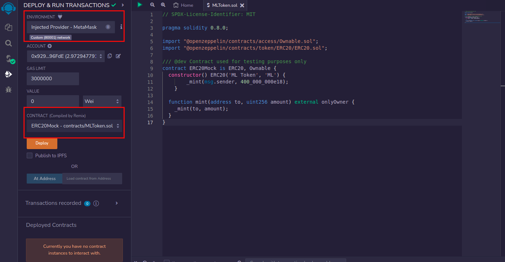

# Steps to test the staking contract

### Deploy ML token in testnet

A test token must first be deployed that will simulate the original ML token. You must enter [remix.ethereum.org](https://remix.ethereum.org/) which looks like this:


Once in the remix home page, a new file must be created. Usually you will see a button that says something like "NEW FILE" in the home page or, if you do not see it, you can find a leaf-shaped icon like in any editor text, that will give you the option to create a new file. We can name the file something like "MLToken" remember that the extension must be .sol `MLToken.sol`


Once the file is created, you must paste the following code into it:

```solidity
// SPDX-License-Identifier: MIT

pragma solidity 0.8.0;

import "@openzeppelin/contracts/access/Ownable.sol";
import "@openzeppelin/contracts/token/ERC20/ERC20.sol";

/// @dev Contract used for testing purposes only
contract ERC20Mock is ERC20, Ownable {
  constructor() ERC20('ML Token', 'ML') {
    _mint(msg.sender, 400_000_000e18);
  }

  function mint(address to, uint256 amount) external onlyOwner {
    _mint(to, amount);
  }
}
```

Note that the constructor calls the mint function using the deployer address, so you will automatically get all tokens in your wallet.


The above contract is a scaled down version of an ERC20 token similar to the original ML, we will use it for testing purposes only.

Then we proceed to compile and deploy that token. First we will go to the compilation section in which we may run into an error regarding the compilation version, we solved that by changing the version selected in remix to the contract version that we just copied which is `0.8.0`

Once the compilation error is solved, we proceed to deploy. Reference capture follows:


Once we are in the deploy section we must select an environment and a web3 provider so we select to connect our Metamask wallet. This will be the option that says "Injected Provider - MetaMask" with which we want to perform the test. Make sure you are in the Mumbai testnet, and also having selected the correct contract to deploy. Reference capture follows:


Since we have everything ready, we press the "DEPLOY" button. After that we will be asked to confirm the transaction, and after a few seconds it should be deployed. Now we will be able to see on that same screen one more section that will allow us to interact with the recently deployed contract, as well as copy the address of the contract (save it because we will need it in the next step). As we were the ones that deployed the contract, we will own all the tokens, to be able to use them in the staking contract.


### Implement staking contract on testnet

The process in this case will be similar to the previous one, you have to create a new file, we can name the file something like "MLStaking", remember that the extension must be .sol `MLStaking.sol`

Once the file is created, you must paste the contract code into the recently created file. After pasting the code, you must modify the constant where the reward contract address is defined, and paste the address of the token that was deployed in the previous step. The place where you should make the replacement looks like this code snippet:

```solidity
/*****************************
* 2. CONSTANTS AND VARIABLES *
******************************/
uint128[] private _enabledMonths = [ 0, 1, 2, 3, 4, 5, 6 ];

/// @dev Address of the token to partially pay rewards.
IERC20 constant STAKING_TOKEN = IERC20(0x281E2Cc83bD4A9930903AAa0a8cd1B521c1eB562);
```

The complete code to be pasted into the `MLStake.sol` file can be found in this repository under the following path `contracts/MLStaking.sol`

Since we have everything ready, we press the "DEPLOY" button. After that we will be asked to confirm the transaction, and after a few seconds it should be deployed. Now we can see on that same screen one more section that will allow us to interact with the recently deployed contract.

### Interacting with the staking contract

Since we have deployed the staking contract, the first thing we need to do is set the amount of tokens dedicated to the pool. 

In the token contract (the one you deployed first) call the `increaseAllowance` function.

It receives two parameters:

a. first parameter is the address of the second contract, which is the staking contract

b. The second parameter is the amount that you are going to designate as rewards, plus the amount that you are going to stake. For example, if you are going to designate 600,000 tokens as a reward, and you are going to stake 10,00 tokens, then you have to pass 610,000 as that second parameter.

IMPORTANT NOTE: Keep in mind that each time you call the updateRewardToDistribute or stake functions in the MLStaking.sol contract, you must FIRST approve those tokens by calling the increaseAllowance function of the token contract.

Next, we can use the stake function to stake some tokens and start receiving rewards.

The stake function receives two parameters:
1. amount_ which is the number of tokens to be staked
2. lockMonths_ which is an integer between 0 and 6 to determine the number of months to lock the tokens

If you want to stake without a lock, you must pass the lockMonths_ parameter as zero.

After some time pass, we can unstake and withdraw the rewards by calling the `getReward` function.